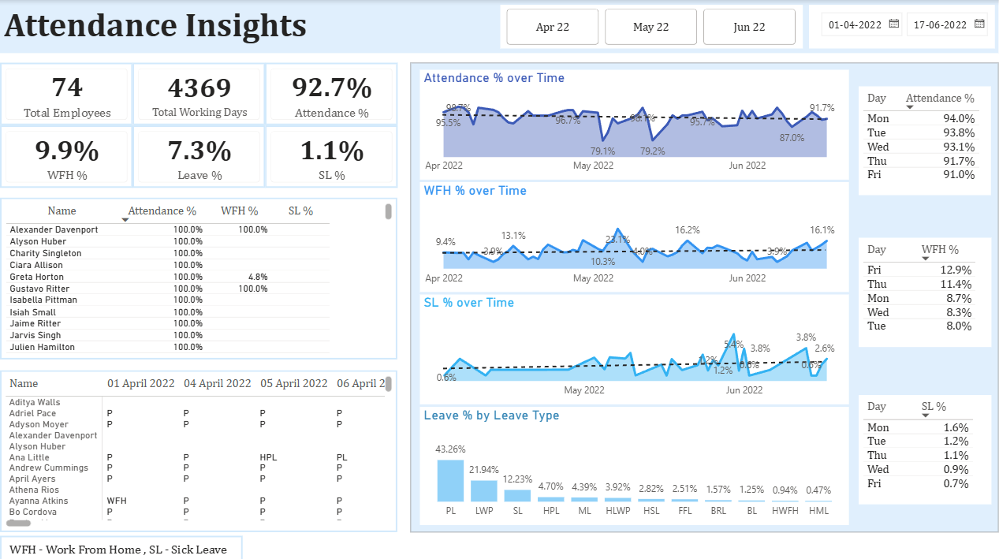

# HR Data Analytics

## 📌 Project Overview

Project Type: Guided Project

Guidance: This project was completed by following a guided tutorial and was independently implemented and analyzed using Excel and Power BI.

This project focuses on analyzing employee attendance data and building an interactive HR attendance dashboard using Power BI.

The objective was to transform raw attendance data into meaningful HR insights related to attendance, leave, work-from-home patterns, and employee attendance behavior.

## 🛠️ Tools Used

- Microsoft Excel
- Power Query
- Power BI
- DAX

## 🔄 Data Preparation

Power Query was used to prepare and transform the attendance data before loading it into Power BI.

Key transformations included:

- Combining attendance data from multiple monthly sheets
- Unpivoting attendance data
- Cleaning and standardizing attendance values
- Mapping attendance codes to attendance and leave categories
- Preparing the data for analysis in Power BI

## 📊 Analysis Performed

- Employee attendance
- Present days
- Leave patterns
- Work-from-home (WFH)
- Sick leave
- Leave types
- Monthly attendance trends
- Attendance patterns by day of the week
- Employees with consistent attendance

## 📈 Key Insights

- Attendance was analyzed across April, May and June 2022.
- April has the highest presence% of 94.5%.
- April has the lowest WFH of 9.0% , leave% of 5.5% and SL% of 0.4%.
- May has the lowest presence% of 90.8%.
- May has the highest SL% of 1.7% and leave% of 9.2%.
- May has the highest WFH% of 11.1%.
- Maximum attendance is seen mostly on Mondays.
- 7 employees have 100% attendance in all three months.
- PL(Paid Leave) is the type of leave taken the most.
- PL is the highest in all three months while other leaves are significantly lower. However, in June, the percentage of other leaves increases compared to the other two months, while the percentage of PL decreases.

## 📷 Dashboard

## 📁 Project Files

- `Attendance-Sheet-2022-2023(Project1).xlsx` — Source attendance data.
- `Project1.pbix` — Power BI dashboard and data model.
- `Project1.png` — Dashboard screenshot.

## 🎯 Skills Demonstrated

- Data cleaning and transformation
- Power Query
- Data modeling
- DAX
- KPI development
- Interactive dashboard design
- HR data analysis
- Business reporting and insights
